```{r setup, include=FALSE}
knitr::opts_chunk$set(echo = TRUE)
```


The cool thing about the Conscious approach, which we used in building [the MLE classifier](https://adpitt6.github.io/DataScience2/Model_1.html) is that we get to learn lots about how people draw things. Like, you can have a whole pizza, or you can have just a slice. Or most bananas dutifully obey the law of gravity, but some mischievous ones don't.

Now, switching gears, think about this: What if we take an Unconscious approach? Put all that domain knowledge we have gained aside (as if we had never even looked at those images) and rely on machine brute force? Can a machine learning algorithm that does not benefit from our human visual perception (and is pretty much a black box) do a decent job at classifying [_Quick! Draw_](https://quickdraw.withgoogle.com/) images? We tried one that is popular for classifying images: a [convolutional neural network](https://en.wikipedia.org/wiki/Convolutional_neural_network). We name it _OurCNN_ (not the news channel).


# _OurCNN_ specs

## Input

32-by-32 image with black/white pixels

## Output

a label out of 31 edibles: 

apple, asparagus, banana, birthday cake, blackberry, blueberry, bread, broccoli, cake, carrot, cookie, donut, grapes, hamburger, hot dog, ice cream, lollipop, mushroom, onion, peanut, pear, peas, pineapple, pizza, popsicle, potato, sandwich, steak, strawberry, string bean, watermelon

note: This is one category more than the number of categories that went into the MLE classifier. Just an error in copying text :-)

## Inside the box

### a. Architecture

2 convolution layers, each with the same structure:

- 32 filters of size 3-by-3, applied with padding
- ReLU activation followed by batch normalization

1 max-pooling layer

- filters of size 2-by-2
- followed by 30% dropout

1 dense layer

- 256 neurons
- ReLU activation followed by batch normalization
- 30% dropout

final layer

- 31 neurons (for probabilities of the 31 categories)
- softmax activation


### b. Optimization

loss: categorical cross-entropy

metric: accuracy

stochastic gradient descent:

- learning rate 0.001
- decay 1e-6
- momentum 0.9
- Nesterov accelerated


### c. Training

20 epochs

batch size 32

use 5000 images per type, split 4:1 into training and validation sets -- a fraction of the 140-300K images available per type

pick the model at the epoch that combines _lowest validation loss_ and _highest validation accuracy_, here epoch 12 -- see the training history below

```{r history, echo=FALSE, fig.align='center', out.width = '70%'}
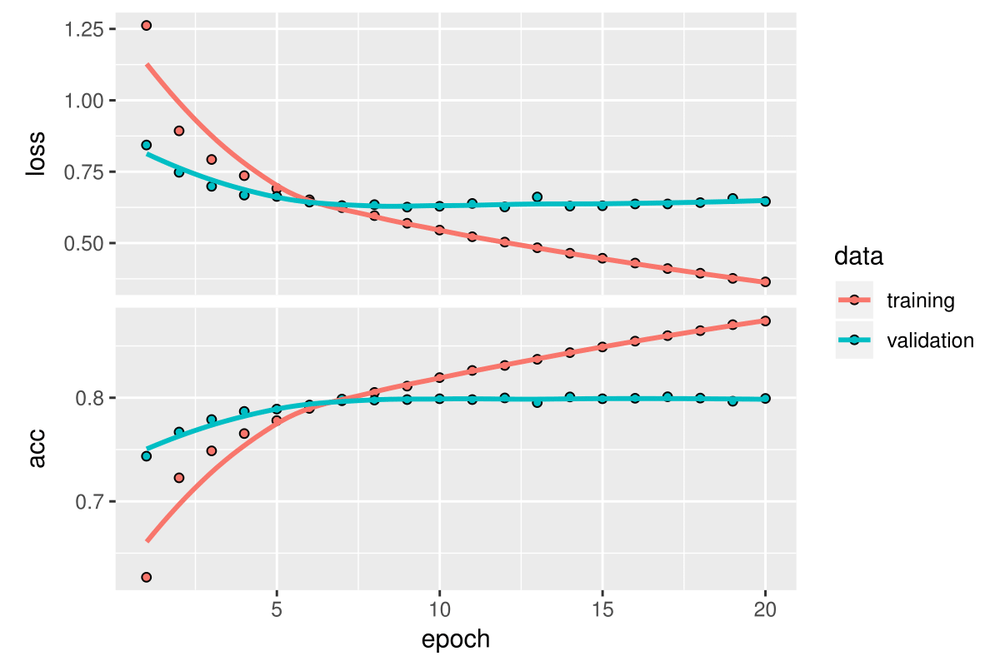
```


### d. Data

#### Data reduction

_Quick! Draw_ images are black-and-white and come in 256-by-256 resolution. The data are stroke data, i.e., for each stroke of the pen, a series of points are stored such that if you connect them with straight segments, you recover the stroke.

The MLE classifier keeps the original resolution, but uses only the points that define the segments.

_OurCNN_ uses those points and points between them, but reduces resolution to 32-by-32.

Here are the three data versions for a watermelon, a sandwich, and a pear.

```{r datareduction, echo=FALSE, fig.align='center', out.width = '70%'}
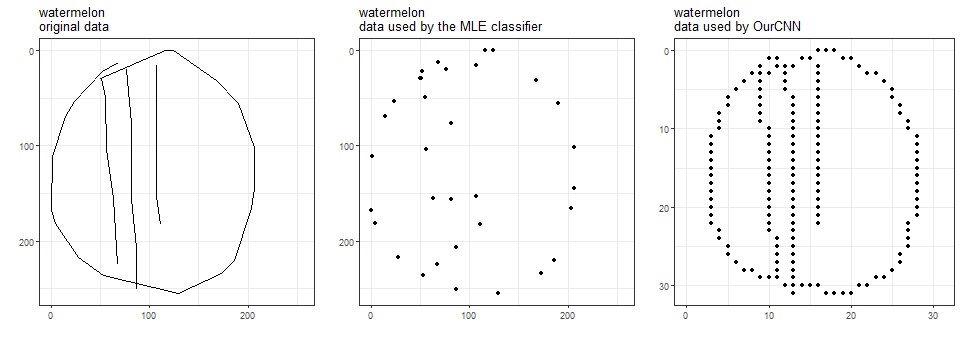
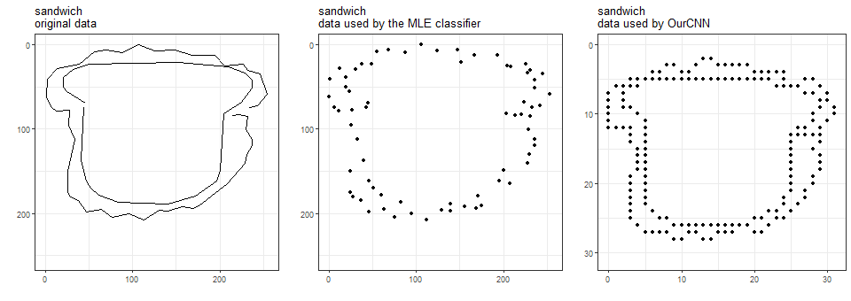
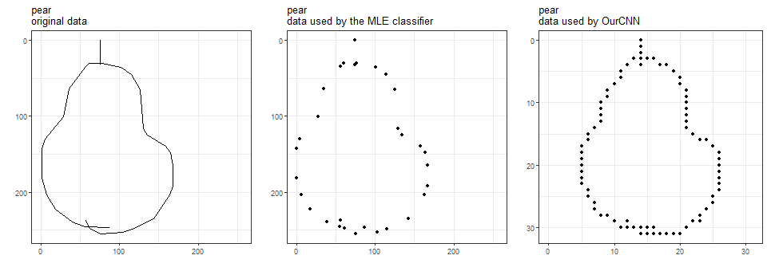
```

Hmm, it is now clear that we trained the MLE classifier using less data than we did _OurCNN_.

Other data that neither classifiers use: time, country of origin, and also stroke sequence (relevant in a fascinating analysis of [how people draw circles](https://qz.com/994486/the-way-you-draw-circles-says-a-lot-about-you/)).


#### Data subsetting

the MLE classifier was trained on a random sample of images of each type, regardless of whether Google AI recognized what type it is.

_OurCNN_ was trained on a random sample of images recognized by Google AI.

Here are two examples of Google-recognized and Google-unrecognized images.

```{r recunrec, echo=FALSE, fig.align='center', out.width = '70%'}
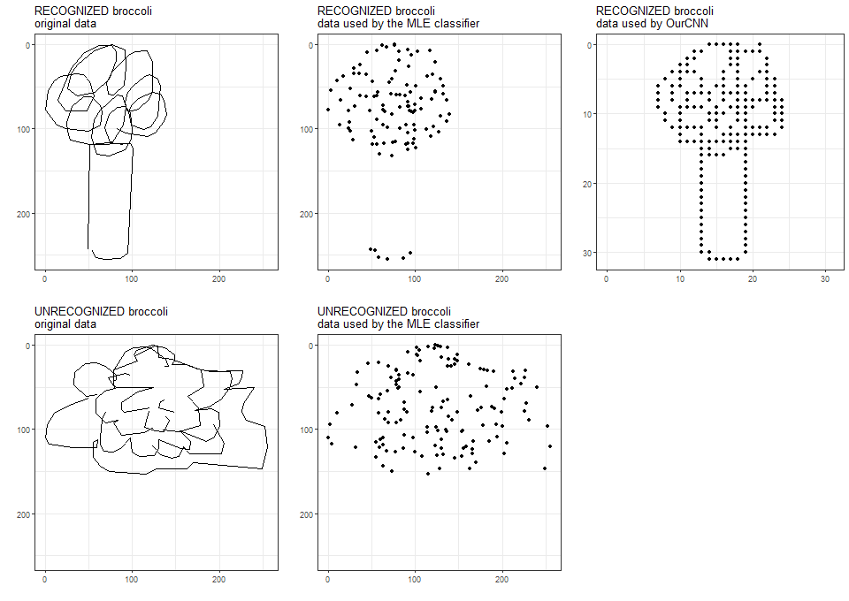
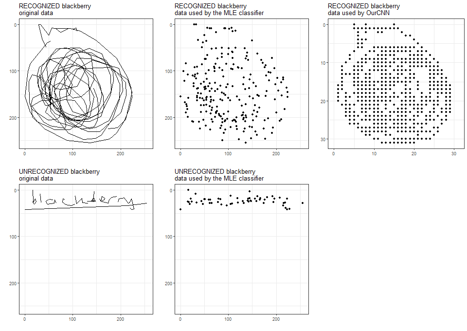
```


# _OurCNN_ performance

## Relative to Google AI

We are, of course, curious to see how _OurCNN_ performs compared to Google AI on each of these edibles. We took a random sample of 1000 images of each edible (regardless of whether they are recognized by Google AI or not) and put them through _OurCNN_. Below is how _OurCNN_ performs on these images, compared to Google AI recognition rates based on the whole [dataset](https://www.kaggle.com/c/quickdraw-doodle-recognition/data) available to us.

```{r cnngoogle, echo=FALSE, fig.align='center', out.width = '70%'}
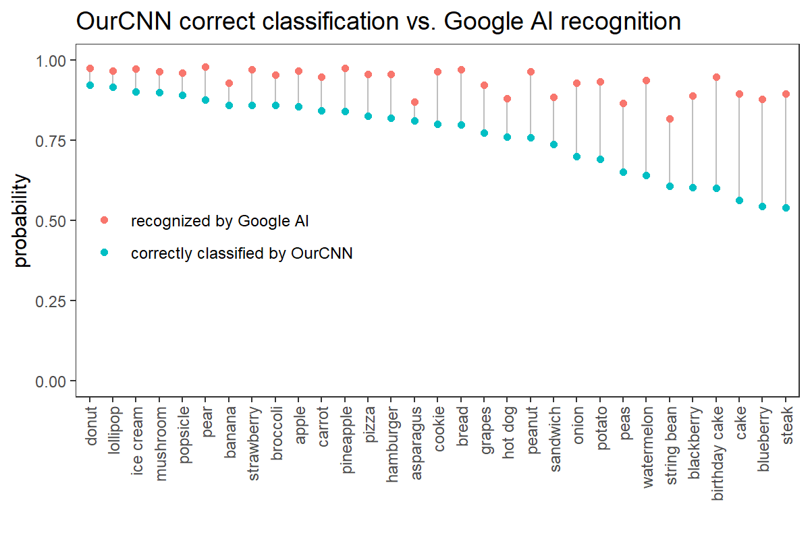
```

Hah, _OurCNN_ is outperformed on ALL the edibles. 

It is amazing that on those that _OurCNN_ really struggles to differentiate, Google AI has recognition rates of 8x-9x percent! And this is even more awesome (for Google!) when you remind yourself that Google AI has to differentiate among 340 different things. _OurCNN_ has the much simpler job of differentiating only 31 of those things (sorry, we don't care much about non-edibles).


## On Google-recognized images

As _OurCNN_ was trained on images whose category, it is appropriate to first look at how it performs on a random test set of Google-recognized images (again, 1000 images per edible). This performance is shown in the classification probability matrix below, where the edibles are sorted by classification accuracy.

```{r recognized, echo=FALSE, fig.align='center', out.width = '70%'}
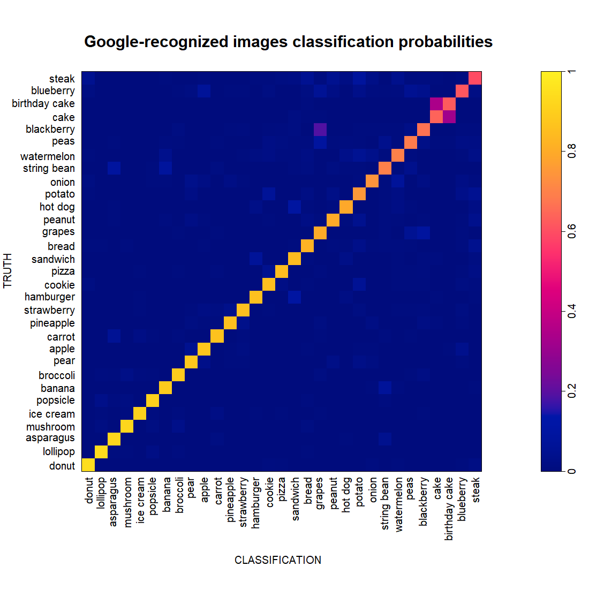
```

_OurCNN_ does better for some edibles and worse for others. Like we saw before when building the MLE classifier, cakes and birthday cakes are often confused. And from the perspective of _OurCNN_, some blackberries look like grapes.

Let's now zoom into the images that are misclassified and rearrange them a bit, so that we see what each edible tends to be misclassified as.

```{r wrongrecognized, echo=FALSE, fig.align='center', out.width = '70%'}
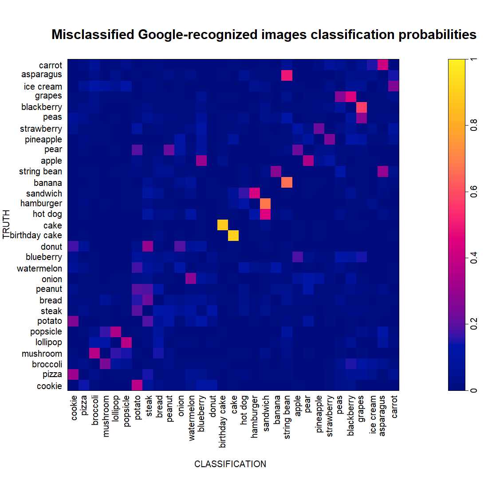
```


It looks like most of the confusion of _OurCNN_ happen in pairs of edibles. Clearly, cake and birthday cake are a pair. Cakes are generally not cake-like enough because they look more like birthdday cakes, and birthday cakes are generally not birthday-y enough because they look more like cakes.

Other pairs are popsicle-lollipop, mushroom-broccoli, strawberry-pineapple, potato-cookie, pear-apple, string bean-banana, etc.

Some edibles are involves in more than one pair. Grapes is in a primary pair with blackberry, and in a secondary pair with peas. String been is paired with both banana and asparagus. Apple is paired with both blackberry and pear.

There are some one-way relationships. Cookie is the object of classification for bad pizza but much less the opposite. Steak is an object of classification for donut, but not the other way around. Quite a few bad pears look like peanuts, but few bad peanuts look like pears.

Let's look at several of the pairs.

```{r eightpairs, echo=FALSE, fig.align='center', out.width = '80%'}
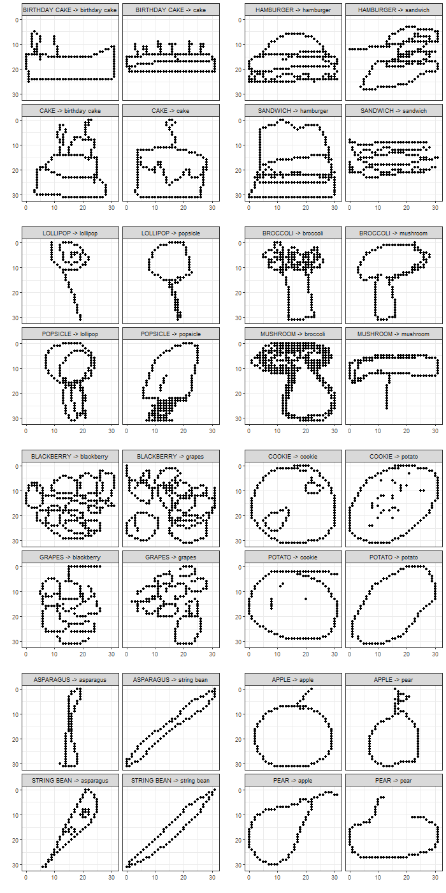
```

Interesting! Some of them, we can kind of see why. Some of them, not.


## On Google-unrecognized images

We now subject _OurCNN_ to a random set of Google-unrecognized images.

```{r unrecognized, echo=FALSE, fig.align='center', out.width = '70%'}
knitr::include_graphics("docs/TrangPlots/unrecognized_ordered.png")
```

At the highest, _OurCNN_ correctly classifies 38% of the pizza images in this set. At the lowest, 6.8% of the pear images. Contrast this with the probability of 0.032 when tossing a 31-sided coin.

It is interesting that there seem to be some favorites among the labels (blackberry and peas) for classifying any random category. Do bad drawings tend to have certain types of strokes that are commonly present in blackberry and/or peas drawings? Let's look at some of these non-blackberries that are classified as blackberries (below, left) next to some good (Google-recognized) blackberries that _OurCNN_ also classified as blackberries (below, right).

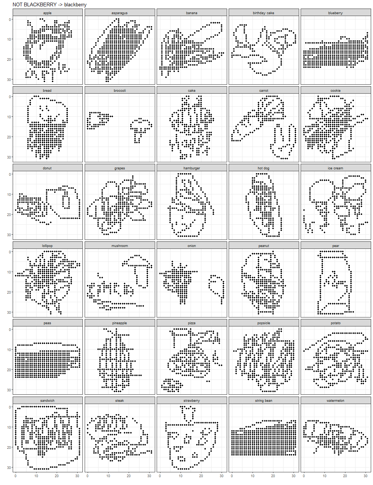{width=49%} 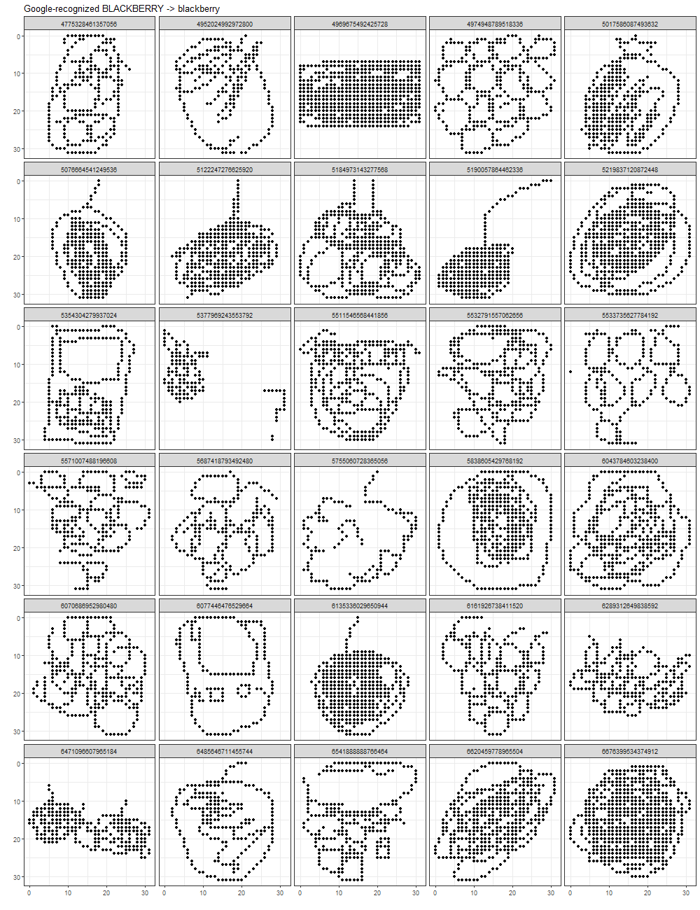{width=49%}

Perhaps the one thing in common between these two sets of images is that there are a lot of busy pixels!

Wait! Isn't it super cool that _OurCNN_ includes Blackberry the hand-held device?

To be complete, let's also look at the classification probabilities of Google-unrecognized images that are misclassified by _OurCNN_.


```{r wrongunrecognized, echo=FALSE, fig.align='center', out.width = '70%'}
knitr::include_graphics("docs/TrangPlots/wrong_unrecognized_reordered.png")
```

We do not see anything additional here that was not noticed before.

<!-- the overall Google-recognized rate for an equal-weight mixture of these 31 edibles is 93.2%. -->


# Conclusions

This Unconscious approach works quite well.

While _OurCNN_ is nothing compared to Google AI, it is limited by several resources that we guess do not affect Google AI: (1) we use only a fraction of the data to train the classifier (5K images/edible, compared to the 140-300K images/edible available); (2) we wanted to try more powerful architectures, but could not handle them computationally.

_OurCNN_ in its current version took several days to train on one of our laptop computer without GPU and has to deal with other tasks while running this. If and when we manage to use Hopkins's cluster computing resources for the training, we would be able to see if we can get a more powerful version of _OurCNN_ and see how it compares with Google AI.

Comparing these two early products -- or prototypes, to be precise -- from the Conscious and Unconscious approaches, we venture to say that the Unconscious approach is a contender. Perhaps humans and machines have different ways to see things that both are valuable.

But, let's recognize that such comparison is unreasonable. We know well (from the data reduction plots above) that the MLE classifier is malnourished. With a lot more data (both data from each image and number of images), the MLE classifier might be a lot more powerful. We need to try that and come back to you.
