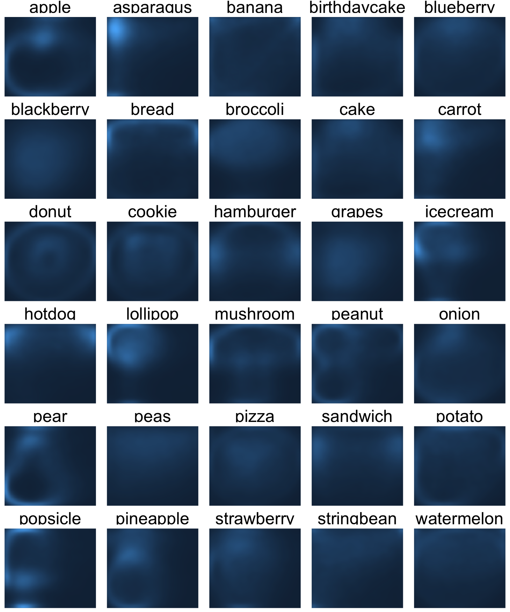

```{r, echo=FALSE}
library(knitr)
```

#### Initial Plots

The first task we had was to plot a lot of drawings all at once. Looking at drawings individually would have been very time consuming. We chose to overlay 500 drawings on top of one another of each type to get a sense of the variability of shapes for each drawing. Here are the plots for apples, mushrooms, and bread:

##### Figure 1: 500 Drawings of Apples, Mushrooms, and Bread
```{r, echo=F, out.width=300, out.height=300}
myimages<-c("plots/Apple2.png","plots/Mushroom2.png","plots/Bread2.png")
knitr::include_graphics(myimages)
```
Even though we have plotted a ridiculous amount of images on top of one another, we can still see the underlying common object that inspired each class of drawings.

We asked the question: what if we didn't connect the lines for each drawing? Since each drawing consists of a number of points connected in a path, we could just ignore how the points are connected and focus on the location of the points.

##### Figure 2: 500 Densities of Apples, Mushrooms, and Bread
```{r, echo=F, out.width=300, out.height=300}
myimages<-c("plots/Apple.png","plots/Mushroom.png","plots/Bread.png")
knitr::include_graphics(myimages)
```

The images certainly become more difficult to recognize, but there is still a barely recognizeable shape there. This motivates our first approach: using the class distribution of the points to empirically construct a kernel that could help us classify the images.

Our next step was to create a kernel by smoothing over the empirical distribution of the points for each image class. We used kernel smoothing with a package called "ks" to go from the sample densities to a smoothed kernel.

##### Figure 3: Smoothed Class Kernels
```{r, echo=F, out.width=1200, out.height=1500}

```

We can still recognize some of the image classes from the kernels, however, for others we can't. We went back to the data and realized there might be a number of ways that each class can be drawn. Let's look at the watermelon, bananas, and peanuts. 

##### Figure 4: 500 Drawings of Watermelons, Bananas, and Peanuts
```{r, echo=F, out.width=300, out.height=300}
myimages<-c("plots/Watermelon2.png","plots/Banana2.png","plots/Peanut2.png")
knitr::include_graphics(myimages)
```

It is very clear that people tended to draw two types of peanuts: a sideways peanut or a vertical peanut. Additionally, some people drew a half slice of watermelon while others drew a whole watermelon. If we look very carefully, we can see that there were many ways people chose to draw bananas. We can think of these variations as sub-classes. If we can somehow separate each class of drawings into less-variable sub-classes, and estimate a kernel for each subclass separately, our prediction algorithm might improve. 