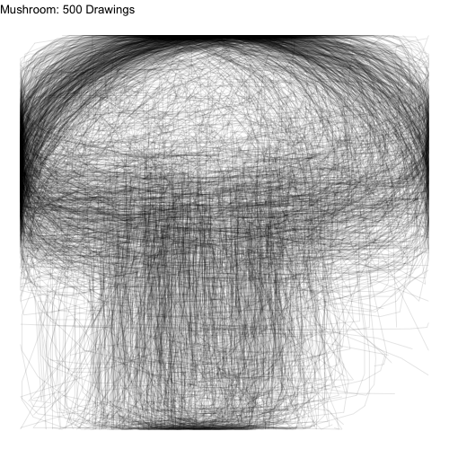
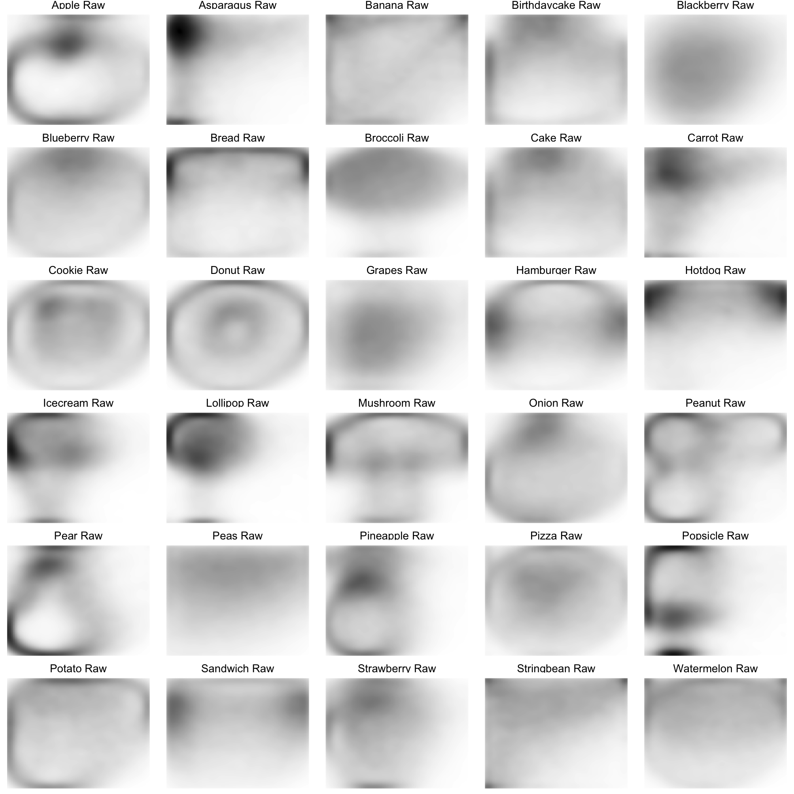
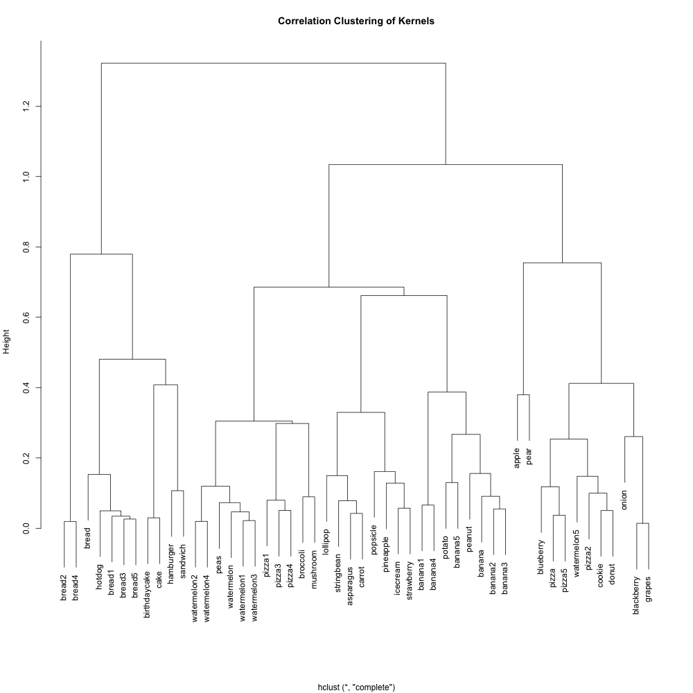
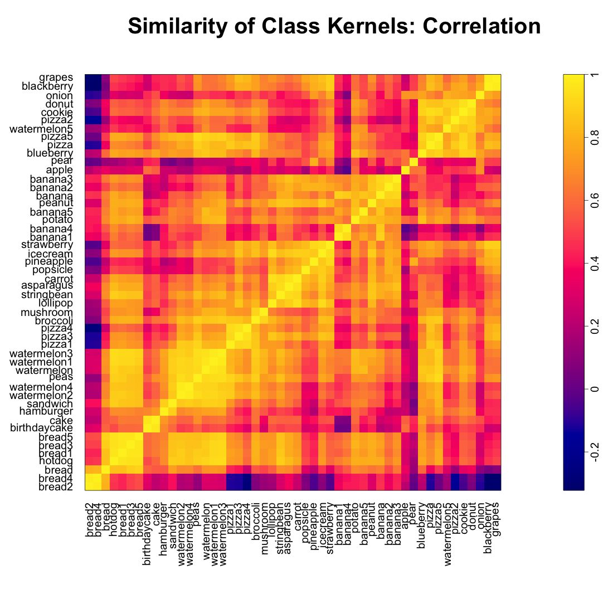

```{r, echo=FALSE}
library(knitr)
```

## Initial Plots

The first task we had was to plot a lot of drawings all at once. Looking at drawings individually would have been very time consuming. We chose to overlay 500 drawings on top of one another of each type to get a sense of the variability of shapes for each drawing. Here are the plots for apples, mushrooms, and bread:

##### Figure 1: 500 Drawings of Apples, Mushrooms, and Bread





Even though we have plotted a ridiculous amount of images on top of one another, we can still see the underlying common object that inspired each class of drawings.

We asked the question: what if we didn't connect the lines for each drawing? Since each drawing consists of a number of points connected in a path, we could just ignore how the points are connected and focus on the location of the points.

##### Figure 2: 500 Densities of Apples, Mushrooms, and Bread
```{r, echo=F, out.width=300, out.height=300}
myimages<-c("plots/Apple.png","plots/Mushroom.png","plots/Bread.png")
knitr::include_graphics(myimages)
```

The images certainly become more difficult to recognize, but there is still a barely recognizeable shape there. Then we smooth these images for each of the classes using kernel density smoothing.  

##### Figure 3: Smoothed Class Kernels
```{r, echo=F, out.width=1200, out.height=1500}

```

We can still recognize some of the image classes from the kernels (pears, donuts, etc.). However, some kernels are unrecognizeable. We went back to the data and realized there might be a number of ways that each class can be drawn. Let's examine the watermelon, bananas, and peanuts. 

##### Figure 4: 500 Drawings of Watermelons, Bananas, and Peanuts
```{r, echo=F, out.width=300, out.height=300}
myimages<-c("plots/Watermelon2.png","plots/Banana2.png","plots/Peanut2.png")
knitr::include_graphics(myimages)
```

People tended to draw two types of peanuts: a sideways peanut or a vertical peanut. Additionally, some people drew a half slice of watermelon while others drew a whole watermelon. If we look very carefully, we can see that people draw bananas in many orientations. 

For the watermelons, we can think of the variations as sub-classes. If we can somehow separate the watermelon class of drawings into sub-classes (whole, half, wedge), and estimate a kernel for each subclass separately, our prediction algorithm might improve. 
For bananas and peanuts, we can think of the variations in drawings being due to rotation. If we can find a way to rotate training and test data prior to kernel estimation and prediction (respectively), our algorithm may also improve.

## Rotating Data to a Standard Orientation

A source of variation in the images is how the artist chose to orient their drawing. For some drawings, such as the apple, doodlers uniformly choose to place their apple upright. However, there was a lot of varaition in how artists chose to draw bananas (as seen above).

We chose to rotate the images using a principal components (PC) rotation. We standardized the images so that the longest dimension of the image would go in the vertical direction. We then rescaled and shifted the images so that they would fit in the left-most part of the frame. The PC-rotated kernels and the original kernels are plotted below.

##### Figure 5: Smoothed Class Kernels with and without PC Rotations

```{r, echo=F}
myimages<-c("Empirical_Kernel/Kernels_withRotations.png")
knitr::include_graphics(myimages)
```

If we compare the empirical kernels before and after rotating, we see rotated kernels are more recognizeable for some food classes, but less so for others--the asparagus has a defined stalk, the banana has a defined crescent shape, the carrot has pointy ends, the potato is an oval shape, the string bean is long and narrow, the peanuts are all standing up, and the watermelon has a crescent on one side. 

In contrast, with pre-rotation, the kernels of other food classes become more indistinct or even look like other foods. The broccoli foliage at the top of the frame disappears the mushroom looks like a doughnut, and the pineapple and strawberry lose their characteristic foliage at the top. 

The rotation seems to benefit food classes that are long and symmetrical in their longest direction (bananas and string beans), muddle food classes that are long and assymmetrical in their longest direction (pineapple and lollipops), and have little effect on rounder objects (doughnuts and cookies). 

Moving forward, we will likely only use the pre-rotated kernels for the food classes that look good: 
string bean, potato, peanut, carrot, banana, asparagus, watermelon, hotdog.

## Determining Food Sub-Classes

From earlier exploratory data analysis, it became clear that certain food classes might be drawn in qualitatively different ways. Pizzas and watermelons might be drawn as a slice or a circle. Bread might be a loaf or a square slice.

One way we might think of separating each class into sub-classes is a clustering approach. But what features might we use to cluster? We chose to do the clustering by measuring where each image hits the side of the 256 x 256 frame. We know that the images were preprocessed in such a way that each image hits both the top and left side of the frame as well as the bottom or the right sides. Whether and where the image hits each side of the frame might tell us which sub-class the image falls into.

We can plot the multivariate distributions of the side-hit locations for each food class and visually scan for clustering patterns. We see the clustering patterns in watermelons, bananas, and peanuts below:

##### Figure 6: Side-Hit Patterns for Watermelons (left), Bananas (center), and Peanuts (right)
```{r, echo=F, out.width=300, out.height=300}
myimages<-c("plots/watermelon_cluster.png",
	"plots/banana_cluster.png",
	"plots/peanut_cluster.png")
knitr::include_graphics(myimages)
```

If we look at the 500 watermelon sketches, we see that the half-circle watermelons tend to hit the right and left sides of the image at the very top, and they also tend not to hit the bottom of the image. On the other hand, the round watermelons tend to hit every side directly in the center. Hence, we see a clustering pattern in the distribution of where the watermelon images hit the side of the frame. 

##### Figure 7: Side-Hit Patterns for Apples (left), Mushroom (center), and Bread (right)
```{r, echo=F, out.width=300, out.height=300}
myimages<-c("plots/apple_cluster.png",
	"plots/mushroom_cluster.png",
	"plots/bread_cluster.png")
knitr::include_graphics(myimages)
```

In contrast, there is no obvious clustering structure in the side-hit patterns for some of the food-classes with a recognizable empirical kernel. We see above that apples tend to hit every side in the middle. For mushrooms, it seems that where the mushroom hits the left side of the frame is correlated with where the mushroom hits the right side of the frame. 

We move forward by beforming k-means clustering on the six measurements given in the plots above for each image class. We chose to search for $k=5$ clusters since the pairswise plots above indicated a maximum of 5 clusters per class. For each cluster we then created a sketch plot to see if there were qualitative differences in the sketches captured by each cluster. Let's plot the clusters for some of the food classes. 

##### Figure 8: Sketch Plots of Food Class Clusters (Pizza, Watermelon, Bread)

```{r, echo=F, out.width=300, out.height=300}
myimages<-c("Cluster_Plots/pizza_rotated.png",
	"Cluster_Plots/watermelon_rotated.png",
	"Cluster_Plots/bread_rotated.png")
knitr::include_graphics(myimages)
```

From the above sketch plots, we see that we have fairly effectively separated pizza  and watermelon slices from the whole versions. Even though we saw 5 clusters in the pair plots above for watermelon, there are really only two types of watermelon.

## Examining Relationships Between Foods

For the sake of "exploratory" data analysis, we also explored which foods looked the most alike, according to our empirical kernels. We examined the point-wise correlation between the empirical kernels for each food class and performed a heirarchical clustering to obtain the following dendogram.

##### Figure 9: Food Class Kernels Clustered by Correlation
```{r, echo=F, out.width=1200, out.height=1500}

```

We see some close relationships between the kernels that make a lot of sense:
Hamburgers and sandiwches; cakes and birthday cakes; broccoli and mushrooms; stringbeans, asparagus, and carrots; apples and pears. Ice creams, typically represented as cones, have the same pointy bottoms as strawberries. Blackberries and grapes are both typically represented as a cluster of circles.

##### Figure 10: Correlation Matrix for Food Class Kernels
```{r, echo=F, out.width=1200, out.height=1500}

```

