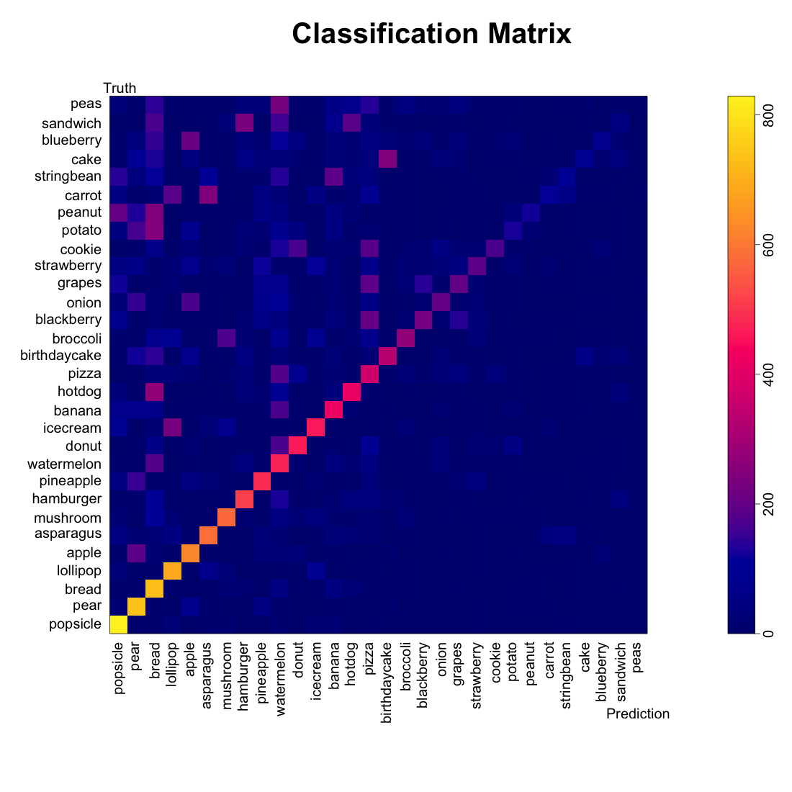
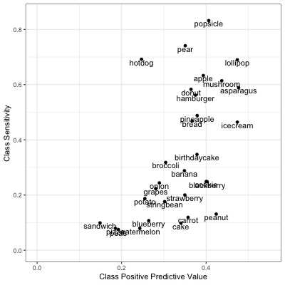

## Basic Idea

As a first try at classifying images, we constructed a simple statistical model.

Since each image consists of a small number of points that make up a path, 
we could think about those points as being iid draws from a two-dimensional density
determined by the food class.

Then, we could compare sample points from each drawing to our smooth empirical density estimate for each food class. We can calculate a log-likelihood that the drawing came from each of the thirty food classes. Finally, we predict that the image came from the class with the largest log-likelihood.

We give an example of this procedure below. 

##### Figure 1: Apple Drawing Overlayed on the Apple and Broccoli Density Estimates
```{r, echo = FALSE, fig.height=3, fig.width=3}
myimages <- c("../Apple_AppleKernel_Plot.png", "../Apple_BroccoliKernel_Plot.png")
knitr::include_graphics(myimages)
```

Above we plot a single apple drawing on top of our smoothed density estimate for the apple and broccoli drawings. The red points represent the sampled points along the image path from the original data. We see that where the red points intersect the Apple kernel in higher-density regions than where the red points intersect the broccoli kernel. Hence, if we sum up the log likelihoods at each of the red points for each class, we see that the likelihood that this image is from the apple class (-462) is higher than the likelihood it is from the broccoli class (-503).

## Model Results

Using this approach, we labeled 1,000 imgaes from each food class and obtained the results below:

##### Figure 2: Classification Matrix

```{r}

```

The classification matrix above was sorted by the class-specific accuracy, and we can see that the accuracy depended highly on the food class: we can classify popsicles, pears, and bread very well (> 700 images each) while we classify cake, sandwiches, and blueberries poorly (< 100 images each).

We also see patterns in the mis-classification--cakes and birthday cakes were often cross-classified. String beans were often labeled as bananas. Broccoli and mushrooms were confused.

We see that certain labels (bread, watermelon, pizzas) seemed to be catch-alls for other foods. We asked whether our algorithm was just labeling MORE things as popsicles, pears, and bread.

##### Class Positive Predictions and Sensitivity

```{r}

```

While we were able to label ~80% of popsicles as popsicles, only about 40% of the things we labeled popsicles were popsicles. If we examine the classification matrix above, we see that many string beans and peanuts were also labeled as popsicles.