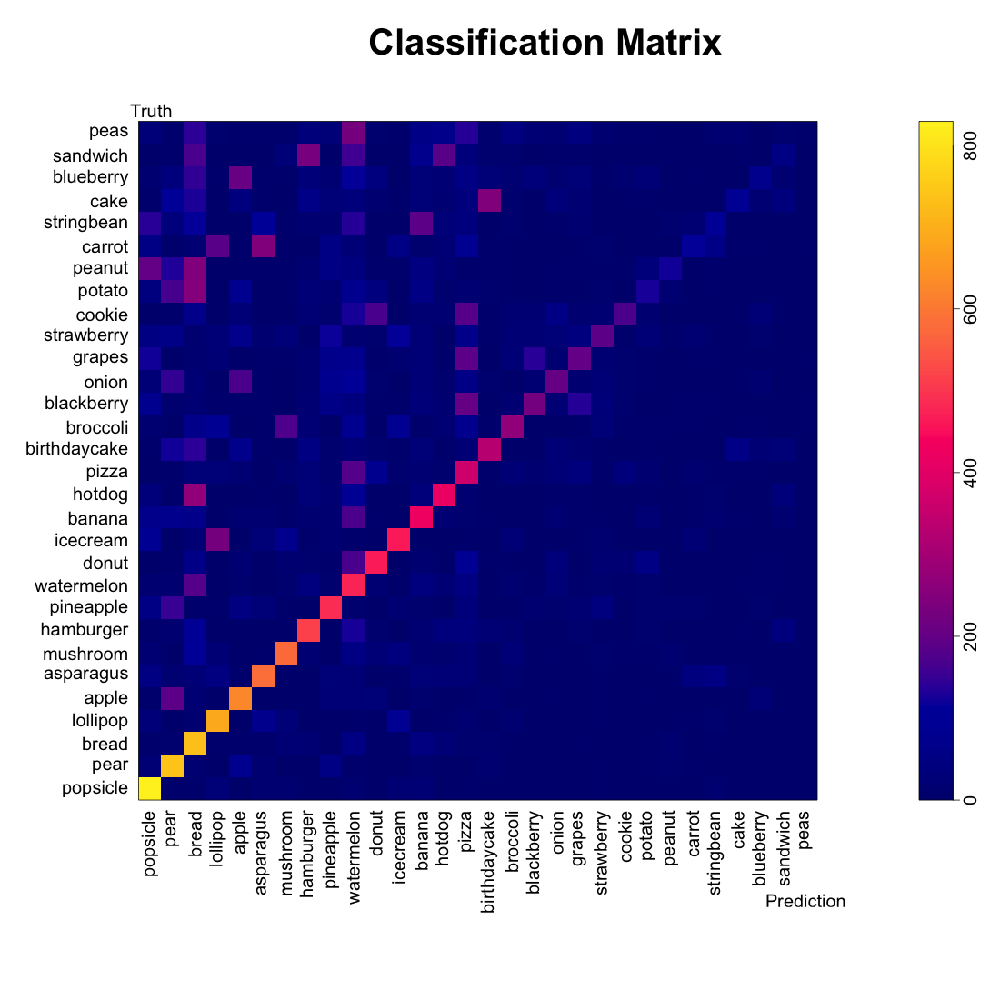
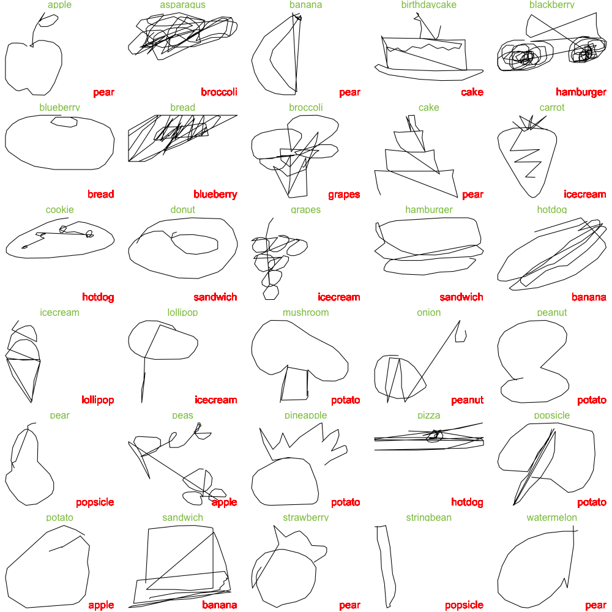

## Basic Idea

As a first try at classifying images, we constructed a simple statistical model. Since each image consists of a small number of points that make up a path, 
we could think about those points as being iid draws from a two-dimensional density
determined by the food class.

Then, we could compare sample points from each drawing to our smooth empirical density estimate for each food class. We can calculate a log-likelihood that the drawing came from each of the thirty food classes. Finally, we predict that the image came from the class with the largest log-likelihood.

We give an example of this procedure below. 

##### Figure 1: Apple Drawing Overlayed on the Apple and Broccoli Density Estimates
```{r, echo = FALSE, fig.height=3, fig.width=3}
myimages <- c("../Empirical_Kernel/Apple_AppleKernel_Plot.png", "../Empirical_Kernel/Apple_BroccoliKernel_Plot.png")
knitr::include_graphics(myimages)
```

Above we plot a single apple drawing on top of our smoothed density estimate for the apple and broccoli drawings. The red points represent the sampled points along the image path from the original data. We see that where the red points intersect the Apple kernel in higher-density regions than where the red points intersect the broccoli kernel. Hence, if we sum up the log likelihoods at each of the red points for each class, we see that the likelihood that this image is from the apple class (-462) is higher than the likelihood it is from the broccoli class (-503).

## Model Results

Using this approach, we labeled 1,000 imgaes from each food class. Of the 30,000 images classified, 35.5% were classified correctly. With complete random guessing, we would expect to classify correctly only 1 in 30 images (3.3%)

##### Figure 2: Classification Matrix

```{r, echo = FALSE}

```

The classification matrix above was sorted by the class-specific accuracy, and we can see that the accuracy depended highly on the food class: we can classify popsicles, pears, and bread very well (> 700 images each) while we classify cake, sandwiches, and blueberries poorly (< 100 images each).

We also see patterns in the mis-classification--cakes and birthday cakes were often cross-classified. String beans were often labeled as bananas. Broccoli and mushrooms were confused.

We see that certain labels (bread, watermelon, pizzas) seemed to be catch-alls for other foods. We asked whether our algorithm was just labeling MORE things as popsicles, pears, and bread.

##### Figure 3: Class Positive Predictions and Sensitivity

```{r, echo = FALSE}
knitr::include_graphics("../Empirical_Kernel/Model1.png")
```

While we were able to label ~80% of popsicles as popsicles, only about 40% of the things we labeled popsicles were popsicles. If we examine the classification matrix above, we see that many string beans and peanuts were also labeled as popsicles.

We also plot a random sample of mis-classified doodles to get a sence of where we might be going wrong.

##### Figure 4: A Sampler of Misclassified Foods
```{r, echo = FALSE}

```

In the sample above, the true labels are given in green text while the classifications are given in red. From the sample above, we see that most of the misclassified images are recognizeable to the human eye, with the exception of the watermelon, sandwich, potato, popsicle, pizza, onion, bread, asparagus, and blackberry (9/30 images).

## Extending the Model

Our exploratory data analysis demonstrated a high degree of rotational variability in some food classes, such as the banana, asparagus, carrot, string bean, potato, and peanut. Other food classes seemed to be made up of multiple food sub-classes (pizza and watermelon). Hence, incorporating  rotatinal variability and sub-classes into our model might improve our predictions.

We consider comparing the following prediction pipelines:

1. **The original model** (as demonstrated above). 
We compare the un-transformed image to the raw kernels.

2. **The rotation model.** We compare the PCA-rotated image (described in the EDA) to the Pre-rotated kernels.

3. **The combined model.** We take whichever label from class one or two that produced a higher log likelihood.

4. **The rotation model with clusters.** 
We add kernels for each subclass that we generated by clustering. We in addition to comparing the raw data to the raw kernels and the rotated data to the rotated kernels, we compare the rotated data to the cluster-generated kernels. 

5. **The cherry picked model**
For each food class, we pick the kernel which we think best represents the data (raw, rotated, or rotated and clustered). We only compare a raw doodle to the raw kernels we have chosen and the rotated doodle to the rotated kernels we have chosen.

We were surprised that our predictions did not get any better by considering  rotations,  clustering, or human selection of rotated vs. raw vs. cluster-derived kernels. 

```{r}
x <- data.frame(Model = 1:5, Accuracy = c(0.35, 0.19, 0.32, 0.32, 0.27))
knitr::kable(x, format = "html")
```


## Discussion and Take-Aways

Our model was very quick to construct, and predicting new images was very quick. We believe the reason for this was largely due to the fact that we kept the data in it's small form. 

For most traditional image processing and classification, the images need to be in a raster format. For an image on a 256 x 256 grid the computer has to store 65,536 numbers for each image. However, we retained the data format provided by google, which stores the images as roughly 50 ordered (x,y) pairs. Hence, we could could easily work with 5,000 images from 30 classes (only 1.5 million numbers) all at once. 

While 