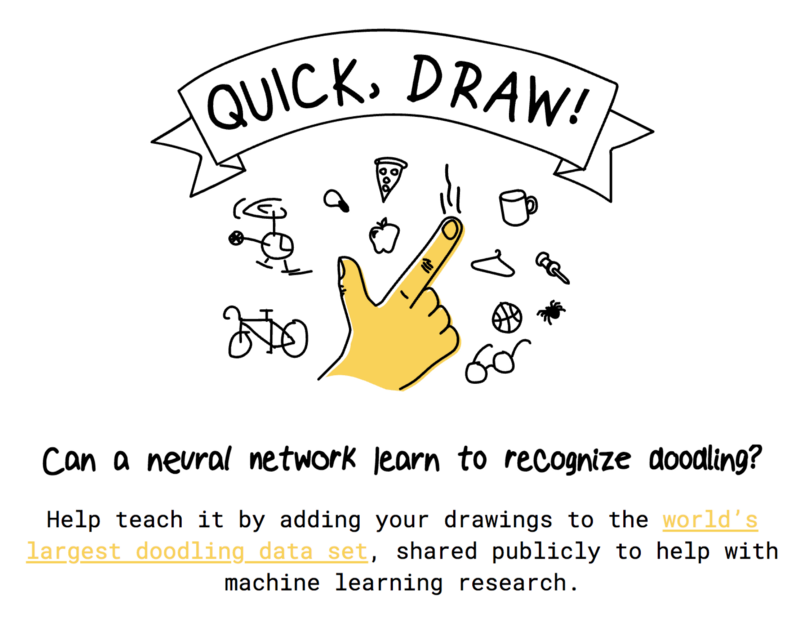
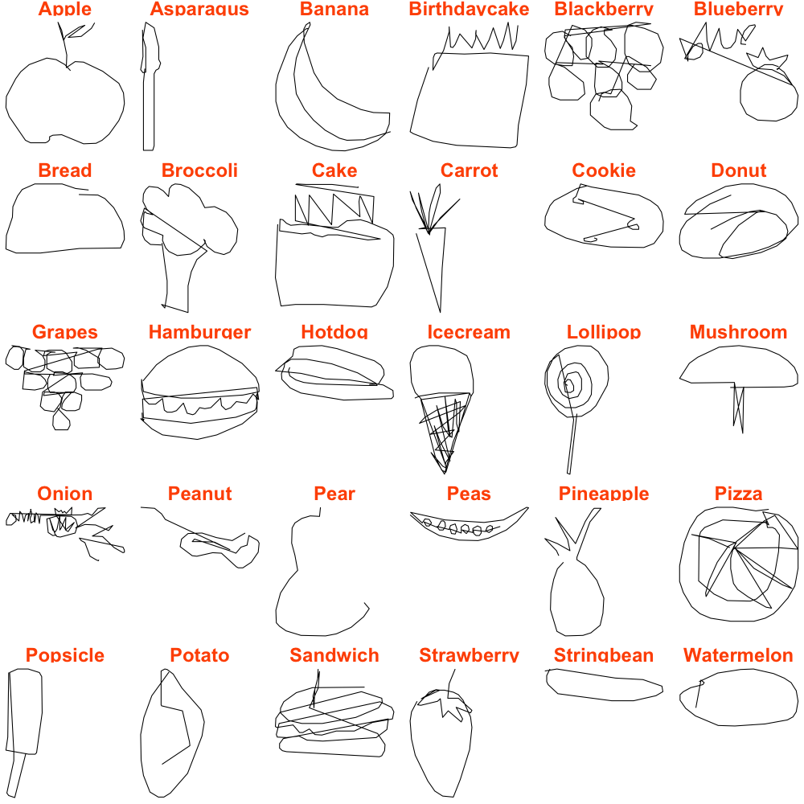

```{r echo = FALSE, message=FALSE}

```


## Quick, Draw!

Are your drawing skills good enough to be recognized by google?

Are we good enough to build a program to recognize your drawings?

Google's internet game QuickDraw prompts players to draw a given object. 
Such objects include an apple, a kangaroo, or the Eiffel Tower. 
You can play the game here: https://quickdraw.withgoogle.com. 
As the player draws the object, Google attempts to guess what the user is drawing. 
In fact, Google uses user-supplied doodles to train an object recognition algorithm.
Google has released some of the doodle data, and has opened up a Kaggle competition for teams to submit their own algorithms. The goal of competing teams is to produce an algorithm that classifies doodles in a test set.


You can download the data from here

##### Figure 1: A Doodle from each Food Class

```{r echo = FALSE, message=FALSE}
library(tidyverse)

```

